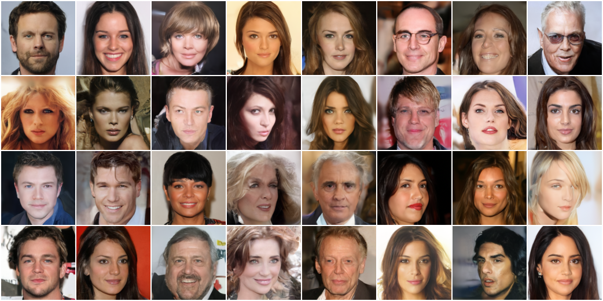

# PaddlePaddle Implementation of Diffusion Model

## 1. Introduction

This is a PaddlePaddle reproduction of Denoising Diffusion Probabilistic Models (DDPM) and Denoising Diffusion Implicit Models (DDIM). We trained the diffusion model with original-designed UNet on CIFAR10 (32X32) and simplified verison (FPN, according to [Keras-DDPM](https://github.com/bojone/Keras-DDPM)) on CelebA-HQ (128X128). 

<div style='color: red'>Warning: We don't recommend you to use the CIFAR10 training script of this repo, because it may have some bugs which may lead to a low FID, and we will try to fix this problem in the future.</div>


- CelebA-HQ (DDPM) generated samples


- CelebA-HQ (DDIM, stride 10) generated samples



- CelebA-HQ (DDPM) progressive generation


## 2. Training

### 2.1 Datasets

- CIFAR10

- CelebA-HQ (please download and place it in datasets folder)

### 2.2 Train from scratch

- CIFAR10

    ```
    # train with default
    python run_cifar10.py
    ```

    `note`: training on Tesla V100 16G GPU with default configuration (800k iters) requires about 100 hours.

- CelebA-HQ

    ```
    # train with default
    python run_celeba_hq.py

    # the sampling procedure in training is time-consupming, you can use '--sample_interval 5000' to reduce the frequency
    ```

    `note`: training on Tesla V100 16G GPU with default configuration (1000k iters) requires about 120 hours.

### 2.3 Resume training

```
# CIFAR10
python run_cifar10.py --resume_ckpt_path '<CHECKPOINT_PATH>' --resume True

# CelebA-HQ
python run_celeba_hq.py --resume_ckpt_path '<CHECKPOINT_PATH>' --resume True
```

## 3. Sampling

### 3.1 Pre-trained Weights

[Baidu Yun](https://pan.baidu.com/s/1VV7IH0mXzIwtCFXlCers7w?pwd=tew7), password: `tew7`

### 3.2 DDPM

- CIFAR10

    ```
    # 1. convert ckpt to pretrained weights
    python run_cifar10.py --pretrained_path './ckpts/ddpm_cifar10_i800000_ema.pdparam' --resume_ckpt_path './ckpts/cifar10_ckpt_iter_800000.pdparam' --mode 'convert'

    # 2. sample 400 images (20X20)
    python run_cifar10.py --pretrained_path './ckpts/ddpm_cifar10_i800000_ema.pdparam' --num_images '400-20-20' --mode 'denoise'

    # 3. sample 16 images with progressive generation
    python run_cifar10.py --pretrained_path './ckpts/ddpm_cifar10_i800000_ema.pdparam' --num_images '16-4-4'  --mode 'denoise' --sample_postfix 'ddpm_cifar10_sequence' --sequence True
    ```

- CelebA-HQ

    ```
    # 1. convert ckpt to pretrained weights
    python run_celeba_hq.py --pretrained_path './ckpts/ddpm_celeba_hq_i1000000_ema.pdparam' --resume_ckpt_path './ckpts/celeba_hq_ckpt_iter_1000000.pdparam' --mode 'convert'

    # 2. sample 64 images (8X8)
    python run_celeba_hq.py --pretrained_path './ckpts/ddpm_celeba_hq_i1000000_ema.pdparam' --num_images '64-8-8' --mode 'denoise' --batchsize 64

    # 3. sample 8 images with progressive generation
    python run_celeba_hq.py --pretrained_path './ckpts/ddpm_celeba_hq_i1000000_ema.pdparam' --num_images '8-4-2'  --mode 'denoise' --sample_postfix 'ddpm_celeba_hq_sequence' --sequence True
    ```

### 3.3 DDIM

`note`: you need to convert the weights if you want to use the checkpoints (see 2.1)


- CIFAR10

    ```
    # 1. sample 400 images (20X20)
    python run_cifar10_ddim.py --pretrained_path './ckpts/ddpm_cifar10_i800000_ema.pdparam' --num_images '400-20-20'
    ```

- CelebA-HQ

    ```
    # 1. sample 64 images (8X8)
    python run_celeba_hq_ddim.py --pretrained_path './ckpts/ddpm_cifar10_i1000000_ema.pdparam' --num_images '64-8-8' --batchsize 64
    ```

## 3. References

- Paper

1. [Denoising Diffusion Probabilistic Models](https://arxiv.org/abs/2006.11239)
2. [Denoising Diffusion Implicit Models](http://arxiv.org/abs/2010.02502)

- Code

1. [Keras-DDPM](https://github.com/bojone/Keras-DDPM)
2. [diffusion](https://github.com/hojonathanho/diffusion)
3. [ddim](https://github.com/ermongroup/ddim)
4. [pytorch-ddpm](https://github.com/w86763777/pytorch-ddpm)
